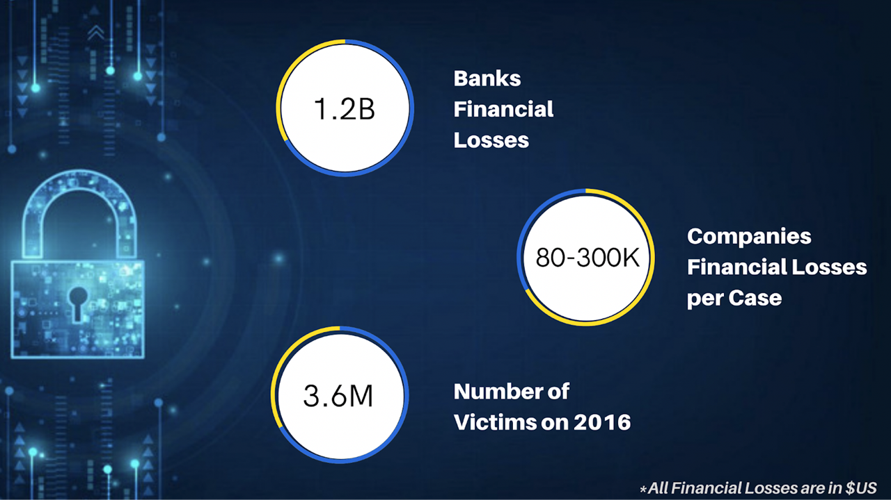

# Cybercrime Awareness In Saudi Arabia

## Project Intro/Objective

The purpose of this project is predict if someone is a victim or not by using many different models.

## Business Statement 

### Methods Used
* Train Test Split
* OneHot Encoder
* Label Encoder
* Select KBest
* PCA
* Pipeline
* Grid SearchCV
* Logistic Regression
* Decision Tree Classifier
* Random Forest Classifier
* SVC
* Confusion Matrix

### Technologies
* jupyter
* Tableau
* Pandas
* Numpy 
* Matplotlib
* Seaborn
* Sklearn

## Project Description

Using a cybercrime dataset for bulding a model. At the start , cleaning the data and rechange ,rearrange some variables. After that, start making many plot to show our insights in this dataset. After EDA , Starting to split the data to train and test. Then, using differnt techniques of feature engineering for some columns. The baseline of the target column has been created. For the modling part the project starts with LogisticRegression. After that, Decision Tree Classifier and Random Forest Classifier. The final model is SVC. Using pipeline, grid searchCV and confusion matrix with these models and some models using PCA while others are using select kbest. The final step is compare all models together and see which models is the best for out business case.

## Contents

- data cleaning
- data exploration
- data visualization
- feature engineering
- baseline
- different modling techniques

## Report
[Report Link](https://github.com/Abdullah-albutih/Cybercrime/blob/main/Report/CyberCrime_Awareness_Report.ipynb)

## Tableau Dasboard
[Dashboard Link](https://public.tableau.com/app/profile/mohammed.saud/viz/project_16262227713860/Dashboard1)

## Team Members

|Name     |  Github Account   | 
|---------|-------------------|
| Abdullah Albutih|[Abdullah-albutih](https://github.com/Abdullah-albutih)|
| Abdulrahman Aljubaylan|[abdulrahman0111](https://github.com/abdulrahman0111)|
| Ahmed Altowairqi|[AhmadBasha](https://github.com/AhmadBasha)|
| Mohammed Albesher|[msb76](https://github.com/msb76)|
| Raghad Almeataz|[Raghad-Almeataz](https://github.com/Raghad-Almeataz)|

